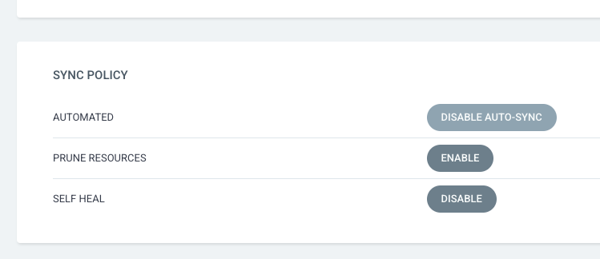

# Basics

We use [ArgoCD](https://argo-cd.readthedocs.io/en/stable/).

## Learning resources

- [YouTube](https://www.youtube.com/results?search_query=ArgoCD)

## How to auto deploy new container images

When you use Auto Sync in ArgoCD, you will also need to make sure your container image tag changes when you create a new
git commit. If you don't do that, ArgoCD doesn't know that the container image changed when the tag doesn't change.

You can build and tag your container image with the current git commit and reference it in ArgoCD by overwriting a helm
property:

```
Inside your helm chart / deployment.yaml:
...
image: "{{ .Values.image.repository }}:{{ .Values.image.tag }}"
...


values.yaml:
...
image:
  tag: placeholder
...


In ArgoCD overwrite this value:
image.tag = $ARGOCD_APP_REVISION
```


## How to use auto sync mechnism

ArgoCD supports automatic syncronisation between your github repository and the cluster state. To use this, you need to
enable auto sync:

- On the left top corner you see the "App Details":

  

- Enable Auto Sync

  

- Enable "Self Heal" if you always want ArgoCD to keep your state in sync. Without this, ArgoCD will stop syncing as
  soon as your project is not green as it will not overwrite potential manual changes you made.
