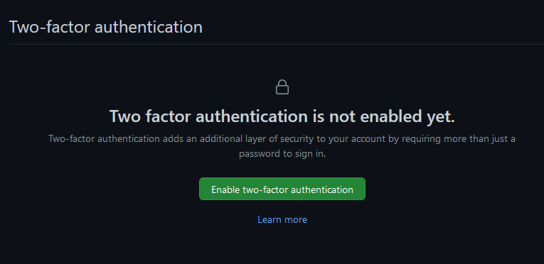
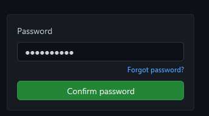
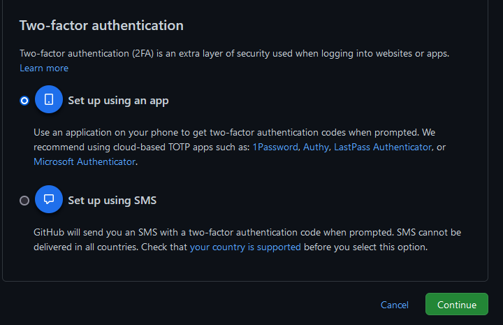
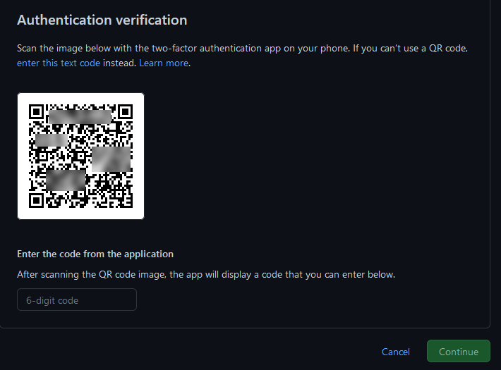
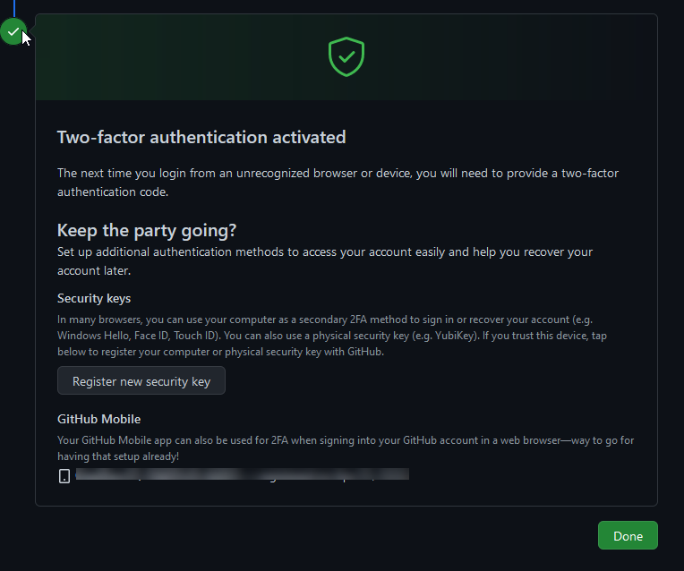
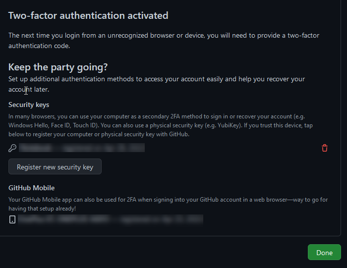

:::caution 2FA usage will be mandatory

Starting Friday, 2022-05-20, the 2 Factor Authentication will be set mandatory for every member in the Catena-X NG organization in Github

:::

**Here´s a description how you can activate 2FA in GitHub for your account**

- open GitHub, login and go to your personal settings by clicking on the avatar in the upper right corner of GitHub
- Choose "*Settings*"
- click "*Password and authentication*" in the menue on the left hand side
- In section "*Two-factor authentication*" click on the green button "*Enable two-factor-authentication*"

	

- Confirm with your GitHub password

	

- Select the method to use for your second factor ("Set up using an app" is preferred)

	

- Set up a new account with your Authenticator App as described, or follow  the other description depending on the hard-/software or other options you have, e.g. Authenticator App

	
	
- Download and save your recovery codes (if the chosen option shows them)

	
	
- Done, or setup additional authentication methods

	
