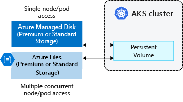
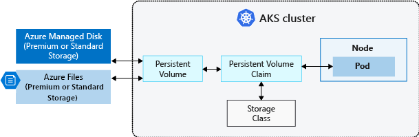
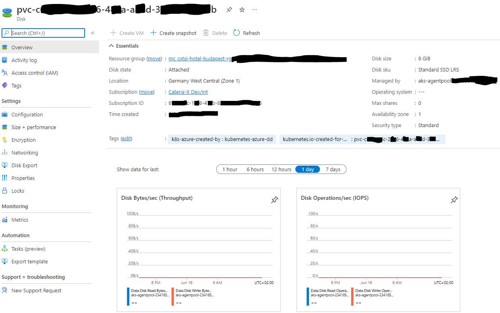

This is a short guide on how to create persistent storage on AKS cluster. It contains basic information, generic examples, and an actual example from our environment.

## Persistent volumes

Volumes defined and created as part of the pod lifecycle only exist until you delete the pod. Pods often expect their storage to remain if a pod is rescheduled on a different host during a maintenance event, especially in StatefulSets. A persistent volume (PV) is a storage resource created and managed by the Kubernetes API that can exist beyond the lifetime of an individual pod.
You can use Azure Disks or Files to provide the PersistentVolume. The choice of Disks or Files is often determined by the need for concurrent access to the data or the performance tier.



:::tip
A PersistentVolume can be dynamically created by the Kubernetes API server. If a pod is scheduled and requests currently unavailable storage, Kubernetes can create the underlying Azure Disk or Files storage and attach it to the pod. Dynamic provisioning uses a StorageClass to identify what type of Azure storage needs to be created.
:::

## Storage class

To define different tiers of storage, such as Premium and Standard, you can create a StorageClass. The StorageClass also defines the reclaimPolicy. When you delete the pod and the persistent volume is no longer required, the reclaimPolicy controls the behavior of the underlying Azure storage resource. The underlying storage resource can either be deleted or kept for use with a future pod.

:::tip
Unless you specify a StorageClass for a persistent volume, the default StorageClass will be used. Ensure volumes use the appropriate storage you need when requesting persistent volumes.
:::

## Storage classes in Catena-X clusters

| NAME                  |  PROVISIONER       | RECLAIMPOLICY | VOLUMEBINDINGMODE    | ALLOWVOLUMEEXPANSION |
| --------------------- | ------------------ | ------------- | -------------------- | -------------------- |
| azurefile             | file.csi.azure.com | Delete        | Immediate            | true                 |
| azurefile-csi         | file.csi.azure.com | Delete        | Immediate            | true                 |
| azurefile-csi-premium | file.csi.azure.com | Delete        | Immediate            | true                 |
| azurefile-premium     | file.csi.azure.com | Delete        | Immediate            | true                 |
| default (default)     | disk.csi.azure.com | Delete        | WaitForFirstConsumer | true                 |
| managed               | disk.csi.azure.com | Delete        | WaitForFirstConsumer | true                 |
| managed-csi           | disk.csi.azure.com | Delete        | WaitForFirstConsumer | true                 |
| managed-csi-premium   | disk.csi.azure.com | Delete        | WaitForFirstConsumer | true                 |
| managed-premium       | disk.csi.azure.com | Delete        | WaitForFirstConsumer | true                 |

## Persistent volume claims

A PersistentVolumeClaim requests storage of a particular StorageClass, access mode, and size. The Kubernetes API server can dynamically provision the underlying Azure storage resource if no existing resource can fulfill the claim based on the defined StorageClass. The pod definition includes the volume mount once the volume has been connected to the pod.



Once an available storage resource has been assigned to the pod requesting storage, PersistentVolume is bound to a PersistentVolumeClaim. Persistent volumes are 1:1 mapped to claims.

## Generic example

Persistent volume claim

```yaml
apiVersion: v1
kind: PersistentVolumeClaim
metadata:
  name: azure-managed-disk
spec:
  accessModes:
  - ReadWriteOnce
  storageClassName: managed-premium-retain
  resources:
    requests:
      storage: 5Gi
```

Pod

```yaml
kind: Pod
apiVersion: v1
metadata:
  name: nginx
spec:
  containers:
    - name: myfrontend
      image: mcr.microsoft.com/oss/nginx/nginx:1.15.5-alpine
      volumeMounts:
      - mountPath: "/mnt/azure"
        name: volume
  volumes:
    - name: volume
      persistentVolumeClaim:
        claimName: azure-managed-disk
```

Windows container

```yaml
...      
       volumeMounts:
        - mountPath: "d:"
          name: volume
        - mountPath: "c:\k"
          name: k-dir
...
```

## Actual example

### BPDM (Argocd app)

#### bpdm-int-postgres

pod

```yaml
apiVersion: v1
kind: Pod
metadata:
...
spec:
...
  volumes:
    - name: data
      persistentVolumeClaim:
        claimName: data-bpdm-int-postgres-0
...
```

pvc

```yaml
apiVersion: v1
kind: PersistentVolumeClaim
metadata:
  annotations:
...
  finalizers:
    - kubernetes.io/pvc-protection
  labels:
    app.kubernetes.io/component: primary
    app.kubernetes.io/instance: bpdm-int
    app.kubernetes.io/name: postgres
  name: data-bpdm-int-postgres-0
  namespace: product-bpdm
...
spec:
  accessModes:
    - ReadWriteOnce
  resources:
    requests:
      storage: 8Gi
  storageClassName: default
  volumeMode: Filesystem
  volumeName: pvc-c......c-2..6-4..a-a..d-3.........b
status:
  accessModes:
    - ReadWriteOnce
  capacity:
    storage: 8Gi
  phase: Bound
```

### This configuration will create the following resources

#### Persistent volume claim

```
NAME                       STATUS   VOLUME                                     CAPACITY   ACCESS MODES   STORAGECLASS
data-bpdm-int-postgres-0   Bound    pvc-c......c-2..6-4..a-a..d-3.........b   8Gi        RWO            default     
```

#### Persistent volume

```
NAME                                       CAPACITY   ACCESS MODES   RECLAIM POLICY   STATUS   CLAIM                                   STORAGECLASS   REASON
pvc-c......c-2..6-4..a-a..d-3.........b   8Gi        RWO            Delete           Bound    product-bpdm/data-bpdm-int-postgres-0   default              

```

#### Reminder: the default storageclass

```
NAME                PROVISIONER          RECLAIMPOLICY   VOLUMEBINDINGMODE      ALLOWVOLUMEEXPANSION
default (default)   disk.csi.azure.com   Delete          WaitForFirstConsumer   true                
```

#### Azure Disk

```
Name                                      Storage account type   Size (GiB)   Owner            Resource group                   Location
pvc-c......c-2..6-4..a-a..d-3.........b   Standard SSD LRS       8            aks-...vmss_18   mc_cxtsi-hotel-budapest-rg_...   Germany West Central
```

