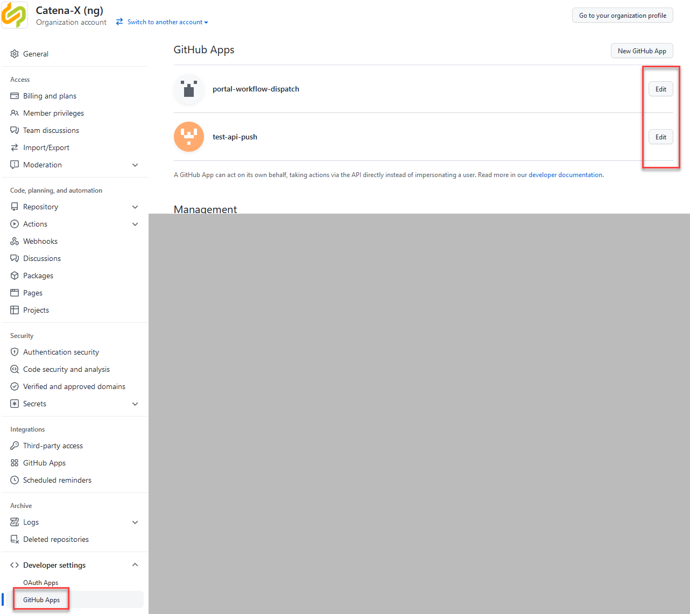

This how-to will guide you through the deployment and configuration of GitHub Apps

## Context

As users don't have admin rights on repositories, they can't trigger actions in other repositories. They could use their PATs, but this is seen as bad practice. But as this got requested more often, we set up GitHub Apps which acts like a technical user.

## Create GitHub App

The app needs to be configured via the organization menu:



The basic setup for the app is configured as described [here](https://docs.github.com/en/developers/apps/building-github-apps/creating-a-github-app)

The individual configuration is described below.

## General

From this menu one needs the app ID:


Further below a private key needs to be created (You need to download it):


These settings need to be stored as secrets, as the users will can use them in their actions/workflows:


In this example PORTAL is the product name:

ORG_PORTAL_DISPATCH_APPID -> app ID from above

ORG_PORTAL_DISPATCH_KEY -> content of private key file

When creating the secret, set the scope (=permissions to the calling repository)

## Permissions & events

Here only permission for actions need to be set to read and write

## Install App

Here you need to choose all source and target repositories


## Additions for the calling worklow

The products need add the following steps to their calling action

```yaml
steps:
- name: Get Token
  id: get_workflow_token
  uses: peter-murray/workflow-application-token-action@v1
  with:
    application_id: ${{ secrets.ORG_REPO_DISPATCH_APPID }}
    application_private_key: ${{ secrets.ORG_REPO_DISPATCH_KEY }}      
- name: trigger-workflow
  id: call_action
  env:
    TOKEN: ${{ steps.get_workflow_token.outputs.token }}
  run: |
    curl -v \
      --request POST \
      --url https://api.github.com/repos/catenax-ng/playground-target/actions/workflows/example.yaml/dispatches \
      --header "authorization: Bearer $TOKEN" \
      --header "Accept: application/vnd.github.v3+json" \
      --data '{"ref":"test_branch","inputs":{"any_data":"anything","any_data2":"anything2"}}' \
      --fail
```

## Additions for the triggered workflow

```yaml
name: Demo
on: 
  workflow_dispatch:
    inputs:
    # any parameter used in calling workflow needs to be declared here
    # setting required to false means it's an optional parameter
      any_data:
        description: "content here"
        required: true
        default: "no content"
      any_data2:
        description: "more data"
        required: false
        default: "no content"
jobs:
  show_workspace:
    runs-on: ubuntu-latest
    steps:
      - run: echo "event payload ${{ github.event.inputs.any_data }}"
```